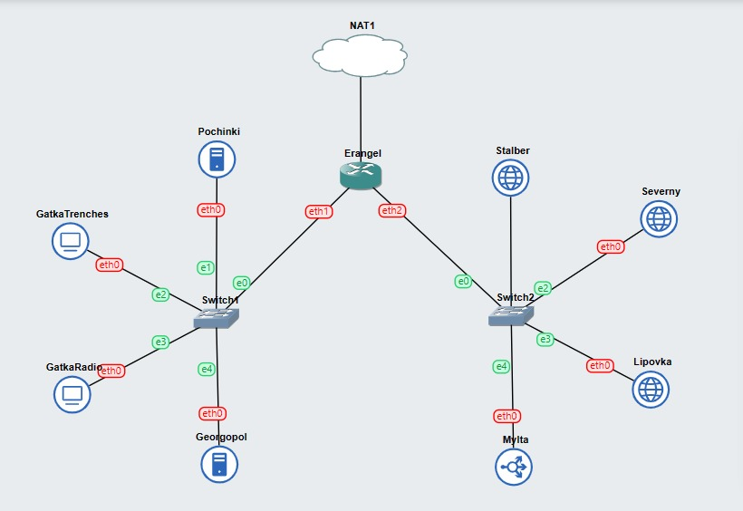
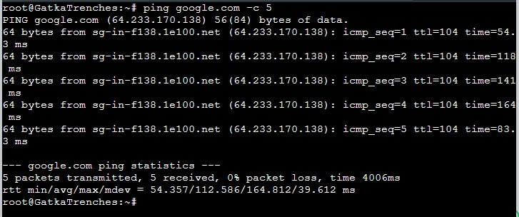
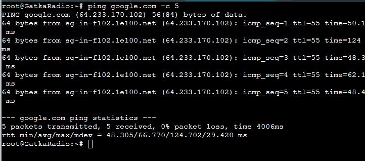
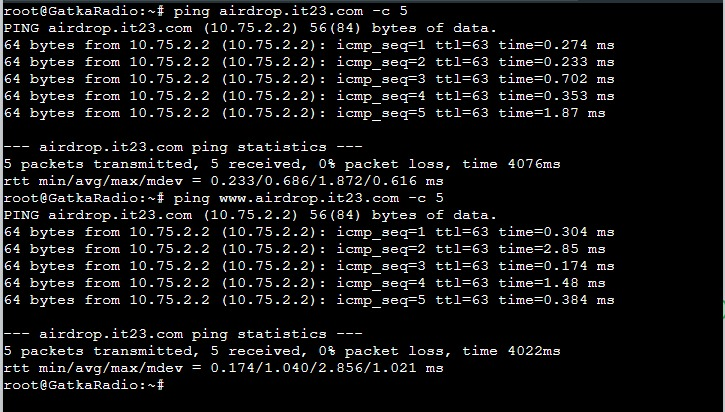
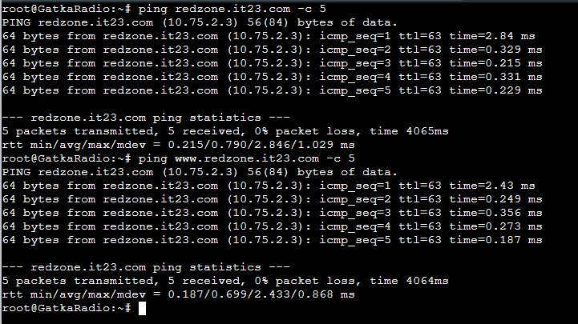
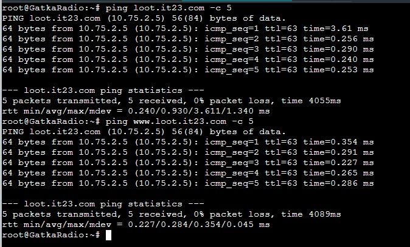
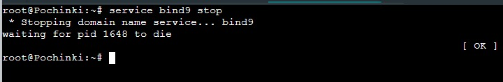
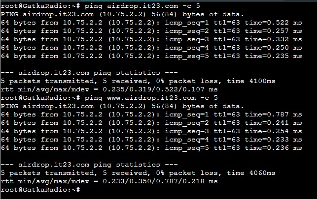
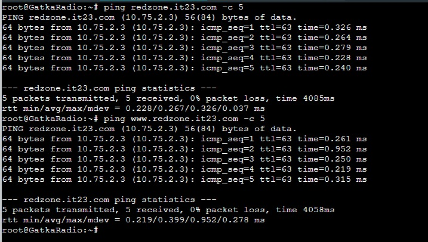
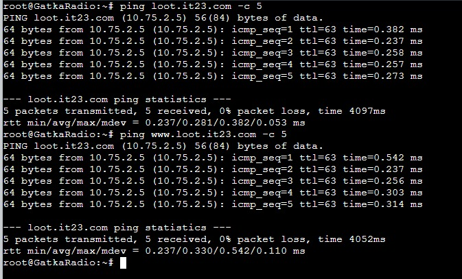

# Jarkom-Modul-2-IT23-2024
**Praktikum Jaringan Komputer Modul 2 Tahun 2024**

# Laporan Resmi
| Nama | NRP |
| ---- | ---- |
| Etha Felisya Br Purba | 5027221017 |
| Rahmad Aji Wicaksono | 5027221034 |

## Daftar Isi
1. [Laporan Resmi](#Laporan-Resmi)
2. [Daftar Isi](#Daftar-Isi)
3. [Topologi](#Topologi)
4. [Config](#Config)
5. [Bashrc](#Bashrc)
6. [Soal 1](#Soal-1)
7. [Soal 2](#Soal-2)
8. [Soal 3](#Soal-3)
9. [Soal 4](#Soal-4)
10. [Soal 5](#Soal-5)
11. [Soal 6](#Soal-6)
12. [Soal 7](#Soal-7)

## Topologi
 
 
## Config

* Erangel
 ```
auto eth0
iface eth0 inet dhcp

auto eth1
iface eth1 inet static
	address 10.75.1.1
	netmask 255.255.255.0

auto eth2
iface eth2 inet static
	address 10.75.2.1
	netmask 255.255.255.0
```
* Pochinki
 ```
auto eth0
iface eth0 inet static
	address 10.75.1.2
	netmask 255.255.255.0
	gateway 10.75.1.1
```
* GatkaTrenches
```
auto eth0
iface eth0 inet static
	address 10.75.1.3
	netmask 255.255.255.0
	gateway 10.75.1.1
```
* GatkaRadio
```
auto eth0
iface eth0 inet static
	address 10.75.1.4
	netmask 255.255.255.0
	gateway 10.75.1.1
```
* Georgopol
```
auto eth0
iface eth0 inet static
	address 10.75.1.5
	netmask 255.255.255.0
	gateway 10.75.1.1
```
* Stalber
```
auto eth0
iface eth0 inet static
	address 10.75.2.2
	netmask 255.255.255.0
	gateway 10.75.2.1
```
* Severny
```
auto eth0
iface eth0 inet static
	address 10.75.2.3
	netmask 255.255.255.0
	gateway 10.75.2.1
```
* Lipovka
```
auto eth0
iface eth0 inet static
	address 10.75.2.4
	netmask 255.255.255.0
	gateway 10.75.2.1
```
* Mylta
```
auto eth0
iface eth0 inet static
	address 10.75.2.5
	netmask 255.255.255.0
	gateway 10.75.2.1
```

## Bashrc
Setiap node, kita inisialisasi pada .bashrc menggunakan nano
* Erangel
```
iptables -t nat -A POSTROUTING -o eth0 -j MASQUERADE -s 192.173.0.0/16
```
* Pochinki
```
echo 'nameserver 192.168.122.1' > /etc/resolv.conf
apt-get update
apt-get install bind9 -y
```
* GatkaTrenches
```
echo -e '
nameserver 10.75.1.2 #IP POCHINKI
nameserver 10.75.1.5 #IP GEORGOPOL
nameserver 192.168.122.1 #IP ERANGEL
' > /etc/resolv.conf
```
* GatkaRadio
```
echo -e '
nameserver 10.75.1.2 #IP POCHINKI
nameserver 10.75.1.5 #IP GEORGOPOL
nameserver 192.168.122.1 #IP ERANGEL
' > /etc/resolv.conf
```
* Georgopol
```
echo 'nameserver 192.168.122.1' > /etc/resolv.conf
```
* Stalber
```
echo 'nameserver 192.168.122.1' > /etc/resolv.conf
```
* Severny
```
echo 'nameserver 192.168.122.1' > /etc/resolv.conf
```
* Lipovka
```
echo 'nameserver 192.168.122.1' > /etc/resolv.conf
```
* Mylta
```
echo 'nameserver 192.168.122.1' > /etc/resolv.conf
```

## Soal 1
```
Untuk membantu pertempuran di Erangel, kamu ditugaskan untuk membuat jaringan komputer yang akan digunakan sebagai alat komunikasi. Sesuaikan rancangan Topologi dengan rancangan dan pembagian yang berada di link yang telah disediakan, dengan ketentuan nodenya sebagai berikut :
DNS Master akan diberi nama Pochinki, sesuai dengan kota tempat dibuatnya server tersebut
Karena ada kemungkinan musuh akan mencoba menyerang Server Utama, maka buatlah DNS Slave Georgopol yang mengarah ke Pochinki
Markas pusat juga meminta dibuatkan tiga Web Server yaitu Severny, Stalber, dan Lipovka. Sedangkan Mylta akan bertindak sebagai Load Balancer untuk server-server tersebut
```
Sebelum mengerjakan kita akan melakukan [setup](#Bashrc), kemudian melakukan testing dari semua node (dibawah adalah contoh testing pada client).

#### Script 
```
ping google.com -c 5
```

#### Result



## Soal 2
```
Karena para pasukan membutuhkan koordinasi untuk mengambil airdrop, maka buatlah sebuah domain yang mengarah ke Stalber dengan alamat airdrop.xxxx.com dengan alias www.airdrop.xxxx.com dimana xxxx merupakan kode kelompok. Contoh : airdrop.it01.com
```
Lakukan [setup](#Bashrc) terlebih dahulu

#### Script
Disini kita akan membuat domain dengan nama airdrop.it23.com dengan alias www.airdrop.it23.com

**Pochinki**
```
echo 'zone "airdrop.it23.com" {
	type master;
	file "/etc/bind/jarkom/airdrop.it23.com";
};' > /etc/bind/named.conf.local

mkdir /etc/bind/jarkom

cp /etc/bind/db.local /etc/bind/jarkom/airdrop.it23.com

echo '
;
; BIND data file for local loopback interface
;
$TTL    604800
@       IN      SOA     airdrop.it23.com. root.airdrop.it23.com. (
                        2024050301      ; Serial
                         604800         ; Refresh
                          86400         ; Retry
                        2419200         ; Expire
                         604800 )       ; Negative Cache TTL
;
@       IN      NS      airdrop.it23.com.
@       IN      A       10.75.2.2     ; IP Stalber
www     IN      CNAME   airdrop.it23.com.' > /etc/bind/jarkom/airdrop.it23.com

```
**GatkaTrenches dan GatkaRadio**
Jangan lupa untuk setup nameserver agar diarahkan ke IP Pochinki.

## Soal 3
```
Para pasukan juga perlu mengetahui mana titik yang sedang di bombardir artileri, sehingga dibutuhkan domain lain yaitu redzone.xxxx.com dengan alias www.redzone.xxxx.com yang mengarah ke Severny

```
Lakukan [setup](#Bashrc) terlebih dahulu

#### Script
Disini kita akan membuat domain dengan nama redzone.it23.com dengan alias www.redzone.it23.com

**Pochinki**
```
echo 'zone "redzone.it23.com" {
	type master;
	file "/etc/bind/jarkom/redzone.it23.com";
};' >> /etc/bind/named.conf.local

cp /etc/bind/db.local /etc/bind/jarkom/redzone.it23.com

echo '
;
; BIND data file for local loopback interface
;
$TTL    604800
@       IN      SOA     redzone.it23.com. root.redzone.it23.com. (
                        2024050301      ; Serial
                         604800         ; Refresh
                          86400         ; Retry
                        2419200         ; Expire
                         604800 )       ; Negative Cache TTL
;
@       IN      NS      redzone.it23.com.
@       IN      A       10.75.2.3     ; IP Severny
www     IN      CNAME   redzone.it23.com.' > /etc/bind/jarkom/redzone.it23.com
```
**GatkaTrenches dan GatkaRadio**
Jangan lupa untuk setup nameserver agar diarahkan ke IP Pochinki.

## Soal 4
```
Markas pusat meminta dibuatnya domain khusus untuk menaruh informasi persenjataan dan suplai yang tersebar. Informasi persenjataan dan suplai tersebut mengarah ke Mylta dan domain yang ingin digunakan adalah loot.xxxx.com dengan alias www.loot.xxxx.com
```
Lakukan [setup](#Bashrc) terlebih dahulu

#### Script
Disini kita akan membuat domain dengan nama loot.it23.com dengan alias www.loot.it23.com

**Pochinki**
```
echo 'zone "loot.it23.com" {
	type master;
	file "/etc/bind/jarkom/loot.it23.com";
};' >> /etc/bind/named.conf.local

cp /etc/bind/db.local /etc/bind/jarkom/loot.it23.com

echo '
;
; BIND data file for local loopback interface
;
$TTL    604800
@       IN      SOA     loot.it23.com. root.loot.it23.com. (
                        2024050301      ; Serial
                         604800         ; Refresh
                          86400         ; Retry
                        2419200         ; Expire
                         604800 )       ; Negative Cache TTL
;
@       IN      NS      loot.it23.com.
@       IN      A       10.75.2.5     ; IP Mylta
www     IN      CNAME   loot.it23.com.' > /etc/bind/jarkom/loot.it23.com
```
**GatkaTrenches dan GatkaRadio**
Jangan lupa untuk setup nameserver agar diarahkan ke IP Pochinki.

## Soal 5
```
Pastikan domain-domain tersebut dapat diakses oleh seluruh komputer (client) yang berada di Erangel
```
**GatkaTrenches dan GatkaRadio**
#### Script
testing pada airdrop.it23.com
```
ping airdrop.it23.com -c 5
ping www.airdrop.it23.com -c 5
```
#### Result


testing pada redzone.it23.com
```
ping redzone.it23.com -c 5
ping www.redzone.it23.com -c 5
```
#### Result


testing pada loot.it23.com
```
ping loot.it23.com -c 5
ping www.loot.it23.com -c 5
```
#### Result


## Soal 6
```
Beberapa daerah memiliki keterbatasan yang menyebabkan hanya dapat mengakses domain secara langsung melalui alamat IP domain tersebut. Karena daerah tersebut tidak diketahui secara spesifik, pastikan semua komputer (client) dapat mengakses domain redzone.xxxx.com melalui alamat IP Severny (Notes : menggunakan pointer record)
```
Lakukan [setup](#Bashrc) terlebih dahulu.

#### Script
```
# Buat reverse DNS (Record PTR)
echo 'zone "2.75.10.in-addr.arpa" {
    type master;
    file "/etc/bind/jarkom/2.75.10.in-addr.arpa";
};' >> /etc/bind/named.conf.local

cp /etc/bind/db.local /etc/bind/jarkom/2.75.10.in-addr.arpa

echo '
;
; BIND data file for local loopback interface
;
$TTL    604800
@       IN      SOA     redzone.it23.com. root.redzone.it23.com. (
                        2024050301      ; Serial
                         604800         ; Refresh
                          86400         ; Retry
                        2419200         ; Expire
                         604800 )       ; Negative Cache TTL
;
2.75.10.in-addr.arpa.   IN      NS      redzone.it23.com.
3                       IN      PTR     redzone.it23.com.   
' > /etc/bind/jarkom/2.75.10.in-addr.arpa
```
jangan lupa untuk mengembalikan nameserver ke DNS Master
**GatkaTrenches dan GatkaRadio**
```
host -t PTR 10.75.1.2
```
#### Result


## Soal 7
```
Akhir-akhir ini seringkali terjadi serangan siber ke DNS Server Utama, sebagai tindakan antisipasi kamu diperintahkan untuk membuat DNS Slave di Georgopol untuk semua domain yang sudah dibuat sebelumnya
```
Lakukan [setup](#Bashrc) terlebih dahulu.

#### Script
**Pochinki**
Pada DNS Master diperlukan setup also-notify dan allow-transfer agar memberikan izin kepada IP yang dituju.
```
if ! grep -q "zone \"airdrop.it23.com\"" /etc/bind/named.conf.local; then
    echo 'zone "airdrop.it23.com" {
        type master;
        notify yes;
        also-notify { 10.75.1.5; }; //IP Georgopol
        allow-transfer { 10.75.1.5; }; //IP Georgopol
        file "/etc/bind/jarkom/airdrop.it23.com";
    };' >> /etc/bind/named.conf.local
fi

if ! grep -q "zone \"redzone.it23.com\"" /etc/bind/named.conf.local; then
    echo 'zone "redzone.it23.com" {
        type master;
        notify yes;
        also-notify { 10.75.1.5; }; //IP Georgopol
        allow-transfer { 10.75.1.5; }; //IP Georgopol
        file "/etc/bind/jarkom/redzone.it23.com";
    };' >> /etc/bind/named.conf.local
fi

if ! grep -q "zone \"loot.it23.com\"" /etc/bind/named.conf.local; then
    echo 'zone "loot.it23.com" {
        type master;
        notify yes;
        also-notify { 10.75.1.5; }; //IP Georgopol
        allow-transfer { 10.75.1.5; }; //IP Georgopol
        file "/etc/bind/jarkom/loot.it23.com";
    };' >> /etc/bind/named.conf.local
fi
```

**Georgopol**
```
echo 'zone "airdrop.it23.com" {
    type slave;
    masters { 10.75.1.2; }; // IP Pochinki
    file "/var/lib/bind/airdrop.it23.com";
};' > /etc/bind/named.conf.local

echo 'zone "redzone.it23.com" {
    type slave;
    masters { 10.75.1.2; }; // IP Pochinki
    file "/var/lib/bind/redzone.it23.com";
};' > /etc/bind/named.conf.local

echo 'zone "loot.it23.com" {
    type slave;
    masters { 10.75.1.2; }; // IP Pochinki
    file "/var/lib/bind/loot.it23.com";
};' > /etc/bind/named.conf.local
```

Untuk memastikan bahwa DNS Slave dapat bekerja sebagaimana mestinya kita harus mematikan service bind9 pada DNS Server,
```
service bind9 stop
```
dan melakukan testing dari client.
**GatkaTrenches dan GatkaRadio**
```
ping airdrop.it23.com -c 5
ping www.airdrop.it23.com -c 5
```
#### Result




