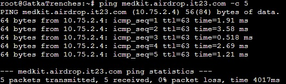
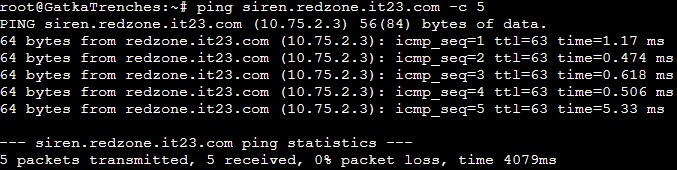
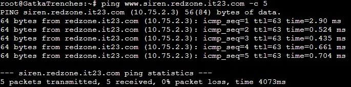
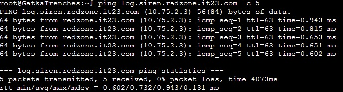
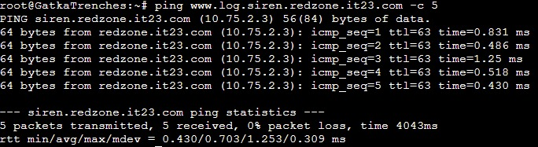
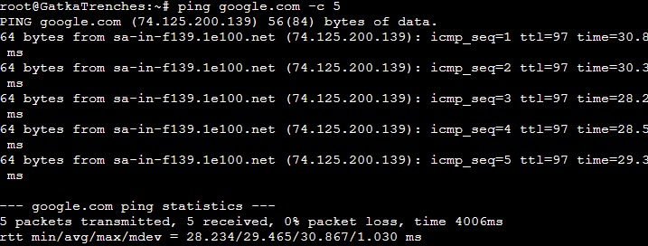
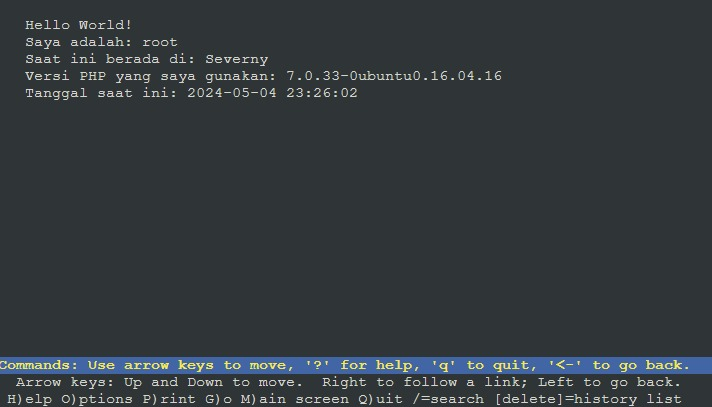

# Jarkom-Modul-2-IT23-2024
**Praktikum Jaringan Komputer Modul 2 Tahun 2024**

# Laporan Resmi
| Nama | NRP |
| ---- | ---- |
| Etha Felisya Br Purba | 5027221017 |
| Rahmad Aji Wicaksono | 5027221034 |

## Daftar Isi
1. [Laporan Resmi](#Laporan-Resmi)
2. [Daftar Isi](#Daftar-Isi)
3. [Topologi](#Topologi)
4. [Config](#Config)
5. [Bashrc](#Bashrc)
6. [Soal 1](#Soal-1)
7. [Soal 2](#Soal-2)
8. [Soal 3](#Soal-3)
9. [Soal 4](#Soal-4)
10. [Soal 5](#Soal-5)
11. [Soal 6](#Soal-6)
12. [Soal 7](#Soal-7)
13. [Soal 8](#Soal-8)
14. [Soal 9](#Soal-9)
15. [Soal 10](#Soal-10)
16. [Soal 11](#Soal-11)
17. [Soal 12](#Soal-12)
18. [Soal 13](#Soal-13)

## Topologi
 
 
## Config

* Erangel
 ```
auto eth0
iface eth0 inet dhcp

auto eth1
iface eth1 inet static
	address 10.75.1.1
	netmask 255.255.255.0

auto eth2
iface eth2 inet static
	address 10.75.2.1
	netmask 255.255.255.0
```
* Pochinki
 ```
auto eth0
iface eth0 inet static
	address 10.75.1.2
	netmask 255.255.255.0
	gateway 10.75.1.1
```
* GatkaTrenches
```
auto eth0
iface eth0 inet static
	address 10.75.1.3
	netmask 255.255.255.0
	gateway 10.75.1.1
```
* GatkaRadio
```
auto eth0
iface eth0 inet static
	address 10.75.1.4
	netmask 255.255.255.0
	gateway 10.75.1.1
```
* Georgopol
```
auto eth0
iface eth0 inet static
	address 10.75.1.5
	netmask 255.255.255.0
	gateway 10.75.1.1
```
* Stalber
```
auto eth0
iface eth0 inet static
	address 10.75.2.2
	netmask 255.255.255.0
	gateway 10.75.2.1
```
* Severny
```
auto eth0
iface eth0 inet static
	address 10.75.2.3
	netmask 255.255.255.0
	gateway 10.75.2.1
```
* Lipovka
```
auto eth0
iface eth0 inet static
	address 10.75.2.4
	netmask 255.255.255.0
	gateway 10.75.2.1
```
* Mylta
```
auto eth0
iface eth0 inet static
	address 10.75.2.5
	netmask 255.255.255.0
	gateway 10.75.2.1
```

## Bashrc
Setiap node, kita inisialisasi pada .bashrc menggunakan nano
* Erangel
```
iptables -t nat -A POSTROUTING -o eth0 -j MASQUERADE -s 192.173.0.0/16
```
* Pochinki
```
echo 'nameserver 192.168.122.1' > /etc/resolv.conf
apt-get update
apt-get install bind9 -y
```
* GatkaTrenches
```
echo -e '
nameserver 10.75.1.2 #IP POCHINKI
nameserver 10.75.1.5 #IP GEORGOPOL
nameserver 192.168.122.1 #IP ERANGEL
' > /etc/resolv.conf
```
* GatkaRadio
```
echo -e '
nameserver 10.75.1.2 #IP POCHINKI
nameserver 10.75.1.5 #IP GEORGOPOL
nameserver 192.168.122.1 #IP ERANGEL
' > /etc/resolv.conf
```
* Georgopol
```
echo 'nameserver 192.168.122.1' > /etc/resolv.conf
```
* Stalber
```
echo 'nameserver 192.168.122.1' > /etc/resolv.conf
```
* Severny
```
echo 'nameserver 192.168.122.1' > /etc/resolv.conf
```
* Lipovka
```
echo 'nameserver 192.168.122.1' > /etc/resolv.conf
```
* Mylta
```
echo 'nameserver 192.168.122.1' > /etc/resolv.conf
```

## Soal 1
> Untuk membantu pertempuran di Erangel, kamu ditugaskan untuk membuat jaringan komputer yang akan digunakan sebagai alat komunikasi. Sesuaikan rancangan Topologi dengan rancangan dan pembagian yang berada di link yang telah disediakan, dengan ketentuan nodenya sebagai berikut :
> - DNS Master akan diberi nama Pochinki, sesuai dengan kota tempat dibuatnya server tersebut.
> - Karena ada kemungkinan musuh akan mencoba menyerang Server Utama, maka buatlah DNS Slave Georgopol yang mengarah ke Pochinki.
> - Markas pusat juga meminta dibuatkan tiga Web Server yaitu Severny, Stalber, dan Lipovka. Sedangkan Mylta akan bertindak sebagai Load Balancer untuk server-server tersebut.

Sebelum mengerjakan kita akan melakukan [setup](#Bashrc), kemudian melakukan testing dari semua node (dibawah adalah contoh testing pada client).

#### Script 
```
ping google.com -c 5
```

#### Result


## Soal 2
> Karena para pasukan membutuhkan koordinasi untuk mengambil airdrop, maka buatlah sebuah domain yang mengarah ke Stalber dengan alamat airdrop.xxxx.com dengan alias www.airdrop.xxxx.com dimana xxxx merupakan kode kelompok. Contoh : airdrop.it01.com

Lakukan [setup](#Bashrc) terlebih dahulu

#### Script
Disini kita akan membuat domain dengan nama airdrop.it23.com dengan alias www.airdrop.it23.com

**Pochinki**  
```
#!/bin/bash

# Buat domain airdrop.it23.com
echo 'zone "airdrop.it23.com" {
	type master;
	file "/etc/bind/jarkom/airdrop.it23.com";
};' > /etc/bind/named.conf.local

mkdir /etc/bind/jarkom

cp /etc/bind/db.local /etc/bind/jarkom/airdrop.it23.com

echo '
;
; BIND data file for local loopback interface
;
$TTL    604800
@       IN      SOA     airdrop.it23.com. airdrop.it23.com. (
                        2024050301      ; Serial
                         604800         ; Refresh
                          86400         ; Retry
                        2419200         ; Expire
                         604800 )       ; Negative Cache TTL
;
@       IN      NS      airdrop.it23.com.
@       IN      A       10.75.2.2     ; IP Stalber
www     IN      CNAME   airdrop.it23.com.' > /etc/bind/jarkom/airdrop.it23.com

service bind9 restart

```
**GatkaTrenches dan GatkaRadio**  
Jangan lupa untuk setup nameserver dan arahkan ke IP Pochinki.

## Soal 3
> Para pasukan juga perlu mengetahui mana titik yang sedang di bombardir artileri, sehingga dibutuhkan domain lain yaitu redzone.xxxx.com dengan alias www.redzone.xxxx.com yang mengarah ke Severny

Lakukan [setup](#Bashrc) terlebih dahulu

#### Script
Disini kita akan membuat domain dengan nama redzone.it23.com dengan alias www.redzone.it23.com

**Pochinki**
```
#!/bin/bash

# Buat domain redzone.it23.com
echo 'zone "redzone.it23.com" {
	type master;
	file "/etc/bind/jarkom/redzone.it23.com";
};' >> /etc/bind/named.conf.local

cp /etc/bind/db.local /etc/bind/jarkom/redzone.it23.com

echo '
;
; BIND data file for local loopback interface
;
$TTL    604800
@       IN      SOA     redzone.it23.com. redzone.it23.com. (
                        2024050301      ; Serial
                         604800         ; Refresh
                          86400         ; Retry
                        2419200         ; Expire
                         604800 )       ; Negative Cache TTL
;
@       IN      NS      redzone.it23.com.
@       IN      A       10.75.2.3     ; IP Severny
www     IN      CNAME   redzone.it23.com.' > /etc/bind/jarkom/redzone.it23.com

service bind9 restart
```
**GatkaTrenches dan GatkaRadio**  
Jangan lupa untuk setup nameserver dan arahkan ke IP Pochinki.

## Soal 4
> Markas pusat meminta dibuatnya domain khusus untuk menaruh informasi persenjataan dan suplai yang tersebar. Informasi persenjataan dan suplai tersebut mengarah ke Mylta dan domain yang ingin digunakan adalah loot.xxxx.com dengan alias www.loot.xxxx.com

Lakukan [setup](#Bashrc) terlebih dahulu

#### Script
Disini kita akan membuat domain dengan nama loot.it23.com dengan alias www.loot.it23.com

**Pochinki**  
```
echo 'zone "loot.it23.com" {
	type master;
	file "/etc/bind/jarkom/loot.it23.com";
};' >> /etc/bind/named.conf.local

cp /etc/bind/db.local /etc/bind/jarkom/loot.it23.com

echo '
;
; BIND data file for local loopback interface
;
$TTL    604800
@       IN      SOA     loot.it23.com. root.loot.it23.com. (
                        2024050301      ; Serial
                         604800         ; Refresh
                          86400         ; Retry
                        2419200         ; Expire
                         604800 )       ; Negative Cache TTL
;
@       IN      NS      loot.it23.com.
@       IN      A       10.75.2.5     ; IP Mylta
www     IN      CNAME   loot.it23.com.' > /etc/bind/jarkom/loot.it23.com
```
**GatkaTrenches dan GatkaRadio**  
Jangan lupa untuk setup nameserver dan arahkan ke IP Pochinki.

## Soal 5
> Pastikan domain-domain tersebut dapat diakses oleh seluruh komputer (client) yang berada di Erangel

**GatkaTrenches dan GatkaRadio**  
#### Script
testing pada airdrop.it23.com
```
ping airdrop.it23.com -c 5
ping www.airdrop.it23.com -c 5
```
#### Result


testing pada redzone.it23.com
```
ping redzone.it23.com -c 5
ping www.redzone.it23.com -c 5
```
#### Result


testing pada loot.it23.com
```
ping loot.it23.com -c 5
ping www.loot.it23.com -c 5
```
#### Result


## Soal 6
> Beberapa daerah memiliki keterbatasan yang menyebabkan hanya dapat mengakses domain secara langsung melalui alamat IP domain tersebut. Karena daerah tersebut tidak diketahui secara spesifik, pastikan semua komputer (client) dapat mengakses domain redzone.xxxx.com melalui alamat IP Severny (Notes : menggunakan pointer record)

Lakukan [setup](#Bashrc) terlebih dahulu.

#### Script
**Pochinki**  
```
#!/bin/bash

# Buat reverse DNS (Record PTR)
echo 'zone "2.75.10.in-addr.arpa" {
    type master;
    file "/etc/bind/jarkom/2.75.10.in-addr.arpa";
};' >> /etc/bind/named.conf.local

cp /etc/bind/db.local /etc/bind/jarkom/2.75.10.in-addr.arpa

echo ';
;
; BIND data file for local loopback interface
;
$TTL    604800
@       IN      SOA     redzone.it23.com. root.redzone.it23.com. (
                        2024050301      ; Serial
                         604800         ; Refresh
                          86400         ; Retry
                        2419200         ; Expire
                         604800 )       ; Negative Cache TTL
;
2.75.10.in-addr.arpa.    IN      NS      redzone.it23.com.
3                       IN      PTR     redzone.it23.com.' > /etc/bind/jarkom/2.75.10.in-addr.arpa

service bind9 restart
```
**GatkaTrenches dan GatkaRadio**  
```
#!/bin/bash

# Set nameserver kembali ke Ip Erangel
echo 'nameserver 192.168.122.1' > /etc/resolv.conf

# Install package dnsutils
apt-get update
apt-get install dnsutils -y

# Kembalikan nameserver ke Ip Pochinki & Georgopol
echo '
nameserver 10.75.1.2
nameserver 10.75.1.5' > /etc/resolv.conf
```  
Testing pada client:
```
host -t PTR 10.75.2.3
```
#### Result


## Soal 7
> Akhir-akhir ini seringkali terjadi serangan siber ke DNS Server Utama, sebagai tindakan antisipasi kamu diperintahkan untuk membuat DNS Slave di Georgopol untuk semua domain yang sudah dibuat sebelumnya.

Lakukan [setup](#Bashrc) terlebih dahulu.

#### Script
**Pochinki**  
Pada DNS Master diperlukan setup also-notify dan allow-transfer agar memberikan izin kepada IP yang dituju.
```
#!/bin/bash

# Tambahkan kebutuhan untuk menjadi master pochinki
echo '
zone "airdrop.it23.com" {
        type master;
        notify yes;
        also-notify { 10.75.1.5; }; //IP Georgopol
        allow-transfer { 10.75.1.5; }; //IP Georgopol
        file "/etc/bind/jarkom/airdrop.it23.com";
};

zone "redzone.it23.com" {
        type master;
        notify yes;
        also-notify { 10.75.1.5; }; //IP Georgopol
        allow-transfer { 10.75.1.5; }; //IP Georgopol
        file "/etc/bind/jarkom/redzone.it23.com";
};

zone "loot.it23.com" {
        type master;
        notify yes;
        also-notify { 10.75.1.5; }; //IP Georgopol
        allow-transfer { 10.75.1.5; }; //IP Georgopol
        file "/etc/bind/jarkom/loot.it23.com";
};' > /etc/bind/named.conf.local

service bind9 restart
```
**Georgopol**  
```
#!/bin/bash

# Tambahkan keperluan untuk menjadi slave georgopol

# Cek apakah bind9 sudah terinstal
if ! command -v named &> /dev/null
then
    echo "Bind9 belum terinstal, melakukan instalasi..."
    # Melakukan instalasi bind9
    apt-get update
    apt-get install bind9 -y
else
    echo "Bind9 sudah terinstal."
fi

echo '
zone "airdrop.it23.com" {
    type slave;
    masters { 10.75.1.2; }; // IP Pochinki
    file "/var/lib/bind/airdrop.it23.com";
};

zone "redzone.it23.com" {
    type slave;
    masters { 10.75.1.2; }; // IP Pochinki
    file "/var/lib/bind/redzone.it23.com";
};

zone "loot.it23.com" {
    type slave;
    masters { 10.75.1.2; }; // IP Pochinki
    file "/var/lib/bind/loot.it23.com";
};' > /etc/bind/named.conf.local

service bind9 restart
```

Untuk memastikan bahwa DNS Slave dapat bekerja sebagaimana mestinya kita harus mematikan service bind9 pada Pochinki sebagai DNS Master,
```
service bind9 stop
```
dan melakukan testing dari client.
**GatkaTrenches dan GatkaRadio**
```
ping airdrop.it23.com -c 5
ping www.airdrop.it23.com -c 5
```
#### Result


## Soal 8
> Kamu juga diperintahkan untuk membuat subdomain khusus melacak airdrop berisi peralatan medis dengan subdomain medkit.airdrop.xxxx.com yang mengarah ke Lipovka.

#### Script
**Pochinki**  
```
#!/bin/bash

# Tambahkan konfigurasi untuk membuat subdomain medkit.airdrop.it23.com
echo '
;
; BIND data file for local loopback interface
;
$TTL    604800
@       IN      SOA     airdrop.it23.com. airdrop.it23.com. (
                        2024050301      ; Serial
                         604800         ; Refresh
                          86400         ; Retry
                        2419200         ; Expire
                         604800 )       ; Negative Cache TTL
;
@       IN      NS      airdrop.it23.com.
@       IN      A       10.75.2.2     ; IP Stalber
www     IN      CNAME   airdrop.it23.com.
medkit  IN      A       10.75.2.4     ; IP Lipovka' > /etc/bind/jarkom/airdrop.it23.com

service bind9 restart
```
Testing pada client:
```
ping medkit.airdrop.it23.com
```

#### Result


## Soal 9
> Terkadang red zone yang pada umumnya di bombardir artileri akan dijatuhi bom oleh pesawat tempur. Untuk melindungi warga, kita diperlukan untuk membuat sistem peringatan air raid dan memasukkannya ke subdomain siren.redzone.xxxx.com dalam folder siren dan pastikan dapat diakses secara mudah dengan menambahkan alias www.siren.redzone.xxxx.com dan mendelegasikan subdomain tersebut ke Georgopol dengan alamat IP menuju radar di Severny.

#### Script 
**Pochinki**  
```
#!/bin/bash

# Tambahkan konfigurasi untuk delegasi siren.redzone.it23.com ke georgopol
echo '
;
; BIND data file for local loopback interface
;
$TTL    604800
@       IN      SOA     redzone.it23.com. redzone.it23.com. (
                        2024050301      ; Serial
                         604800         ; Refresh
                          86400         ; Retry
                        2419200         ; Expire
                         604800 )       ; Negative Cache TTL
;
@       IN      NS      redzone.it23.com.
@       IN      A       10.75.2.3     ; IP Severny
www     IN      CNAME   redzone.it23.com.
ns1     IN      A       10.75.1.5     ; Delegasikan ke georgopol
siren   IN      NS      ns1' > /etc/bind/jarkom/redzone.it23.com

echo '
options {
        directory "/var/cache/bind";

        //dnssec-validation auto;
        allow-query{any;};

        auth-nxdomain no;    # conform to RFC1035
        listen-on-v6 { any; };
};' > /etc/bind/named.conf.options

service bind9 restart
```

**Georgopol**
```
#!/bin/bash

# Tambahkan konfigurasi untuk delegasi siren.redzone.it23.com ke georgopol
echo '
options {
        directory "/var/cache/bind";

        //dnssec-validation auto;
        allow-query{any;};

        auth-nxdomain no;    # conform to RFC1035
        listen-on-v6 { any; };
};' > /etc/bind/named.conf.options

echo 'zone "siren.redzone.it23.com" {
	type master;
	file "/etc/bind/siren/siren.redzone.it23.com";
};' >> /etc/bind/named.conf.local

mkdir /etc/bind/siren

cp /etc/bind/db.local /etc/bind/siren/siren.redzone.it23.com

echo '
;
; BIND data file for local loopback interface
;
$TTL    604800
@       IN      SOA     siren.redzone.it23.com. siren.redzone.it23.com. (
                        2024050301      ; Serial
                         604800         ; Refresh
                          86400         ; Retry
                        2419200         ; Expire
                         604800 )       ; Negative Cache TTL
;
@       IN      NS      siren.redzone.it23.com.
@       IN      A       10.75.2.3     ; IP Severny
www     IN      CNAME   siren.redzone.it23.com.' > /etc/bind/siren/siren.redzone.it23.com

service bind9 restart
```

Testing pada client:
```
ping siren.redzone.it23.com -c 5
ping www.siren.redzone.it23.com -c 5
```

#### Result



## Soal 10
> Markas juga meminta catatan kapan saja pesawat tempur tersebut menjatuhkan bom, maka buatlah subdomain baru di subdomain siren yaitu log.siren.redzone.xxxx.com serta aliasnya www.log.siren.redzone.xxxx.com yang juga mengarah ke Severny.

#### Script
**Georgopol**  
```
#!/bin/bash

# Tambahkan konfigurasi untuk membuat subdomain log.siren.redzone.it23.com
echo '
;
; BIND data file for local loopback interface
;
$TTL    604800
@       IN      SOA     siren.redzone.it23.com. siren.redzone.it23.com. (
                        2024050301      ; Serial
                         604800         ; Refresh
                          86400         ; Retry
                        2419200         ; Expire
                         604800 )       ; Negative Cache TTL
;
@       IN      NS      siren.redzone.it23.com.
@       IN      A       10.75.2.3     ; IP Severny
www     IN      CNAME   siren.redzone.it23.com.
log     IN      A       10.75.2.3     ; IP Severny
www.log IN      CNAME   siren.redzone.it23.com.' > /etc/bind/siren/siren.redzone.it23.com

service bind9 restart
```
Testing pada client:
```
ping log.siren.redzone.it23.com -c 5
ping www.log.siren.redzone.it23.com -c 5
```

#### Result



## Soal 11
> Setelah pertempuran mereda, warga Erangel dapat kembali mengakses jaringan luar, tetapi hanya warga Pochinki saja yang dapat mengakses jaringan luar secara langsung. Buatlah konfigurasi agar warga Erangel yang berada diluar Pochinki dapat mengakses jaringan luar melalui DNS Server Pochinki.

#### Script
**Pochinki**
```
#!/bin/bash

# Tambahkan konfigurasi untuk DNS forwarder
echo '
options {
        directory "/var/cache/bind";

        forwarders {
                192.168.122.1; //IP Erangel
        };
        //dnssec-validation auto;
        allow-query{any;};

        auth-nxdomain no;    # conform to RFC1035
        listen-on-v6 { any; };
};' > /etc/bind/named.conf.options

service bind9 restart
```

**Georgopol**  
```
#!/bin/bash

# Tambahkan konfigurasi untuk DNS forwarder
echo '
options {
        directory "/var/cache/bind";

        forwarders {
                192.168.122.1; //IP Erangel
        };
        //dnssec-validation auto;
        allow-query{any;};

        auth-nxdomain no;    # conform to RFC1035
        listen-on-v6 { any; };
};' > /etc/bind/named.conf.options

service bind9 restart
```

Testing pada client:
```
ping google.com -c 5
```

#### Result


## Soal 12
> Karena pusat ingin sebuah website yang ingin digunakan untuk memantau kondisi markas lainnya maka deploy lah webiste ini (cek resource yg lb) pada severny menggunakan apache.

#### Script
**Pochinki & Georgopol**
```
#!/bin/bash

# Tambahkan nameserver Ip Severny
echo '
nameserver 192.168.122.1
nameserver 10.75.2.3' > /etc/resolv.conf
```

**GatkaTrenches & GatkaRadio**
```
#!/bin/bash

# Tambahkan konfigurasi agar bisa membuka browser
# Cek apakah lynx sudah terinstal
if ! command -v named &> /dev/null
then
    echo "Lynx belum terinstal, melakukan instalasi..."
    # Melakukan instalasi lynx
    apt-get update
    apt-get install lynx -y
else
    echo "lynx sudah terinstal."
fi
```

**Severny**
```
#!/bin/bash

# Tambahkan konfigurasi agar bisa deploy
# Cek apakah apache2 sudah terinstal
if ! command -v named &> /dev/null
then
    echo "Apache2 belum terinstal, melakukan instalasi..."
    # Melakukan instalasi apache2
    apt-get update
    apt-get install apache2 -y
    apt-get install libapache2-mod-php7.0 -y
else
    echo "apache2 sudah terinstal."
fi

# Cek apakah unzip sudah terinstal
if ! command -v named &> /dev/null
then
    echo "Unzip belum terinstal, melakukan instalasi..."
    # Melakukan instalasi unzip
    apt-get update
    apt-get install unzip -y
else
    echo "unzip sudah terinstal."
fi

# Cek apakah php sudah terinstal
if ! command -v named &> /dev/null
then
    echo "PHP belum terinstal, melakukan instalasi..."
    # Melakukan instalasi php
    apt-get update
    apt-get install php -y
else
    echo "php sudah terinstal."
fi

# Download file lb.zip
curl -L -o lb.zip --insecure "https://drive.google.com/uc?export=download&id=1xn03kTB27K872cokqwEIlk8Zb121HnfB"

# Unzip file lb.zip
unzip lb.zip

# Hapus file template
rm -rf /var/www/html/index.php

# Copy file index.php
cp worker/index.php /var/www/html/index.php

service apache2 restart
```

Testing pada client:
```
lynx http://10.75.2.3/index.php
```

### Result


## Soal 13
> Tapi pusat merasa tidak puas dengan performanya karena traffic yag tinggi maka pusat meminta kita memasang load balancer pada web nya, dengan Severny, Stalber, Lipovka sebagai worker dan Mylta sebagai Load Balancer menggunakan apache sebagai web server nya dan load balancernya.

#### Script
**Pochinki & Georgopol**
```
#!/bin/bash

# Tambahkan nameserver Ip Mylta
echo '
nameserver 192.168.122.1
nameserver 10.75.2.5' > /etc/resolv.conf
```

**Stalber & Lipovka**
```
#!/bin/bash

# Tambahkan untuk keperluan load balancer
# Cek apakah apache2 sudah terinstal
if ! command -v named &> /dev/null
then
    echo "Apache2 belum terinstal, melakukan instalasi..."
    # Melakukan instalasi apache2
    apt-get update
    apt-get install apache2 -y
    apt-get install libapache2-mod-php7.0 -y
else
    echo "apache2 sudah terinstal."
fi

# Cek apakah unzip sudah terinstal
if ! command -v named &> /dev/null
then
    echo "Unzip belum terinstal, melakukan instalasi..."
    # Melakukan instalasi unzip
    apt-get update
    apt-get install unzip -y
else
    echo "unzip sudah terinstal."
fi

# Cek apakah php sudah terinstal
if ! command -v named &> /dev/null
then
    echo "PHP belum terinstal, melakukan instalasi..."
    # Melakukan instalasi php
    apt-get update
    apt-get install php -y
else
    echo "php sudah terinstal."
fi

# Download file lb.zip
curl -L -o lb.zip --insecure "https://drive.google.com/uc?export=download&id=1xn03kTB27K872cokqwEIlk8Zb121HnfB"

# Unzip file lb.zip
unzip lb.zip

# Hapus file template
rm -rf /var/www/html/index.php

# Copy file index.php
cp worker/index.php /var/www/html/index.php

service apache2 restart
```

**Mylta**  
```
#!/bin/bash

# Tambahkan keperluan untuk setting load balancer pada Mylta
# Cek apakah apache2 sudah terinstal
if ! command -v named &> /dev/null
then
    echo "Apache2 belum terinstal, melakukan instalasi..."
    # Melakukan instalasi apache2
    apt-get update
    apt-get install apache2 -y
    apt-get install libapache2-mod-php7.0 -y
else
    echo "apache2 sudah terinstal."
fi

# Cek apakah php sudah terinstal
if ! command -v named &> /dev/null
then
    echo "PHP belum terinstal, melakukan instalasi..."
    # Melakukan instalasi php
    apt-get update
    apt-get install php -y
else
    echo "php sudah terinstal."
fi

# Enable apache2 module
a2enmod proxy_balancer
a2enmod proxy_http
a2enmod lbmethod_byrequests
echo '
<VirtualHost *:80>
    <Proxy balancer://serverpool>
        BalancerMember http://10.75.2.2/
        BalancerMember http://10.75.2.3/
        BalancerMember http://10.75.2.4/
        Proxyset lbmethod=byrequests
    </Proxy>
    ProxyPass / balancer://serverpool/
    ProxyPassReverse / balancer://serverpool/
</VirtualHost>' > /etc/apache2/sites-available/000-default.conf

service apache2 restart
```

Testing pada client:
```
lynx http://10.75.2.5/index.php
```

#### Result
https://github.com/zaqueen/Jarkom-Modul-2-IT23-2024/assets/62441217/9840cedd-ede8-4a37-a91a-80e29d10b9ce


